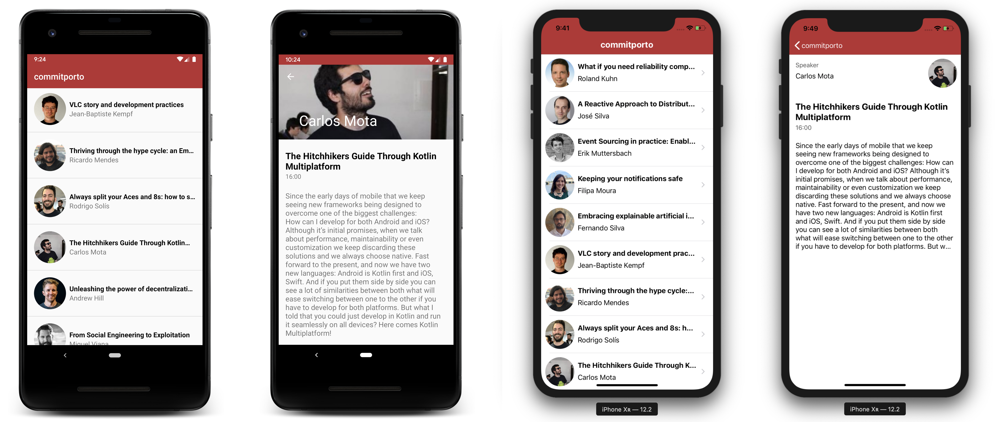

# commit19
Kotlin Multiplatform is here! 🙌

I'm going to give a talk at Commit Porto about it:
 
👉 The Hitchhikers Guide Through Kotlin Multiplaform

This repository contains a demo of a simple application developed to show how we can have a shared logic module between two different targets - in this case, Android and iOS.

## Use case
This is a two-screen application that allows to see all the speakers and talks that are going to happen at Commit Porto.

<h3 align="center">
  
</h3>

## Implementation
I've hosted a Gist [here](https://gist.github.com/cmota/9b911f771f854137e63b73f582bd1e83) with a json that contains all the information about the speakers that will be talking at Commit Porto 19. The logic to download a file and parse it will be similar to both platforms - so why not adding this logic to a common module and leave all the UI implementation to the platforms themselves?

This way, `common` contains all this logic needed and `androidMain` and `iosMain` are just responsible to ask for data to populate the views, in this case a RecyclerView and a UITableViewController accordingly.

## Libraries
- io.ktor:ktor-client-core
- io.ktor:ktor-client-serialization
- org.jetbrains.kotlinx:kotlinx-coroutines-core-common

## How to run
1. Edit local.properties to contain the path to Android SDK
2. Open the project with IntelliJ
3. Select auto-import

Wait for project to sync.

**Compile for Android:**
1. Go to "Add configuration" and select "Android App"
2. Add a name to the configuration (for example "android")
3. Select "app" module and click "OK"

Click on Run to compile and install it on your Android device

**Compile for iOS**
1. Open the iosApp/iosApp.xcodeproj from Xcode

Click on Run to compile and install it on your iOS device

## Extra
If you want to create your first project using Kotlin Multiplatform for Android and iOS you can find this medium post that I've writen [here](https://medium.com/@cafonsomota/set-up-your-first-kotlin-multiplatform-project-for-android-and-ios-e54c2b6574e7).

## More information
We're on the beginning of Kotlin Multiplatform, and there are already amazing projects out there that it take it a bit further, don't forget to give a look at:
- [Kotlin Conf app](https://github.com/jetbrains/kotlinconf-app)
- [Touchlab Droidcon Kotlin](https://github.com/touchlab/DroidconKotlin)
- [Kotlin Academy App](https://github.com/MarcinMoskala/KotlinAcademyApp)
- [Ktor Samples](https://github.com/ktorio/ktor-samples)
- [Kotlin Multiplatform Template](https://github.com/pink-room/kotlin-multiplatform-template)
